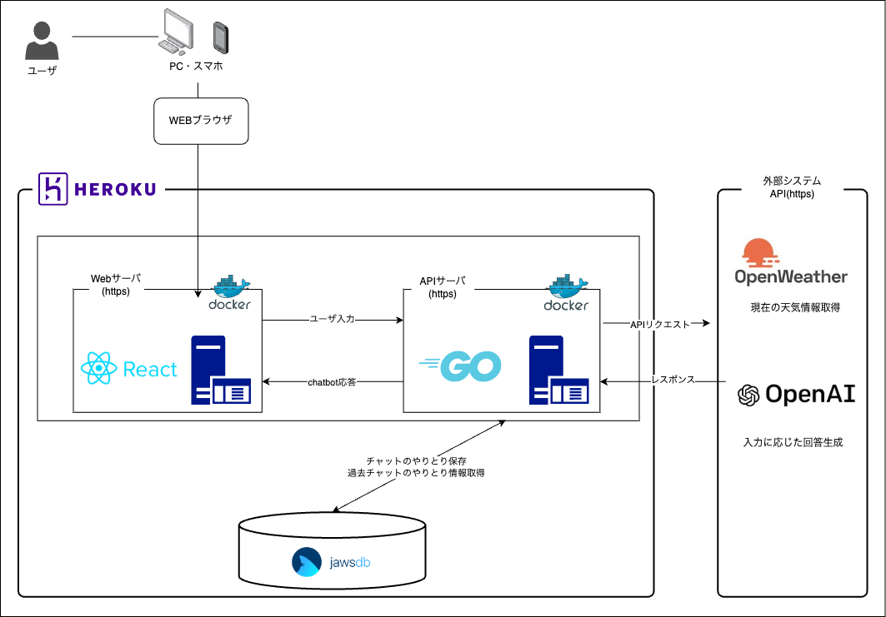

# chatbot-client (React.js, Tailwind CSS, Docker, Heroku)

このプロジェクトのクライアントサイドは、React.js、Tailwind CSS、Docker、および Heroku を使用して開発されました。

## 使用技術

- React.js: 効率的なユーザーインターフェースの構築のための JavaScript ライブラリ
- Tailwind CSS: ユーティリティファーストの CSS フレームワーク
- Docker: アプリケーションのコンテナ化技術
- Heroku: クラウドベースのアプリケーションプラットフォーム

## 外部 API

- OpenWeatherMap: Web やモバイルアプリケーションの開発者に、現在の天候や予測履歴を含む各種気象データの無料 API を提供するオンラインサービ

## 実装方法

### React.js

1. `create-react-app` を使って React.js のプロジェクトを作成しました。
2. コンポーネントベースのアプローチを採用し、アプリケーションの各部分をモジュール化しました。
3. 状態管理には、React の状態フックを使用しました。

### Tailwind CSS

1. プロジェクトに Tailwind CSS を導入しました。
2. ユーティリティクラスを活用して、レスポンシブなデザインを実現しました。
3. カスタムスタイルを適用するために、`@apply`ディレクティブを使用しました。

### Docker

1. Dockerfile を作成して、アプリケーションのコンテナ化を実現しました。

## セットアップ

1. `npm install` コマンドを実行して、必要なパッケージをインストールしてください。
2. `npm start` コマンドを実行して、開発サーバーを起動してください。

これでクライアントサイドがローカル環境で実行できるようになります。詳細については、[公式ドキュメント](リンク)を参照してください。

## デプロイ

1. Heroku CLI をインストールしてください。
2. `heroku login` コマンドを実行し、Heroku アカウントにログインしてください。
3. `heroku create` コマンドを実行して、新しい Heroku アプリを作成してください。
4. `git push heroku main` コマンドを実行して、アプリケーションを Heroku にデプロイしてください。
5. 必要に応じて、Heroku の環境変数を設定してください。

これでアプリが Heroku にデプロイされ、実行できるようになります。詳細については、[公式ドキュメント](リンク)を参照してください。

